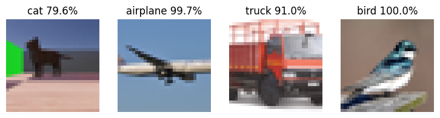
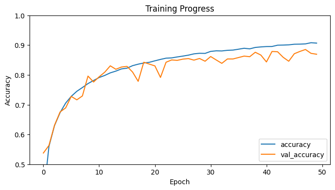

# Webots e-puck Animal Recognition with a CIFAR-10 CNN

An **e-puck** robot in **Webots** explores an arena, avoids obstacles, and watches for colours with its camera. When it finds an animal (a cat model), it stops and takes a photo. That photo is then classified by a **convolutional neural network trained on CIFAR-10** using TensorFlow/Keras.

<p align="center"></p>

These results come from the notebook's training run. The image on the left is the robot's own capture from Webots, and the other three are real-world test photos.

## Pipeline

```
 Webots (e-puck)                                            Python / TensorFlow
┌──────────────────────────────────────────┐              ┌───────────────────────────────────────┐
│ wander + obstacle avoidance (ps0/ps7)    │              │ center-crop → 32×32 (Lanczos) → /255   │
│ camera → average RGB                     │  saves PNG   │ final_model_v3.keras (CIFAR-10 CNN)   │
│   • red / green / blue box → report it   │ ───────────▶ │ softmax → class + confidence          │
│   • matches cat colour → stop + capture  │ cat_capture  │ e.g. "CAT (79.60%)"                   │
└──────────────────────────────────────────┘    _0.png    └───────────────────────────────────────┘
```

## Part 1: Webots robot

| Controller | What it does |
|---|---|
| [`cw2controller`](webots/controllers/cw2controller/cw2controller.py) | Drives forward and, when the front sensors `ps0`/`ps7` detect something, backs up and turns left. Every 5 steps it averages the camera's RGB. A **red, green or blue** box is reported the first time it's seen (the channel must be ≥ 120 and beat the other two by 60). The robot keeps a list of the colours it has seen so far. |
| [`cw3code`](webots/controllers/cw3code/cw3code.py) | Everything above, plus **cat detection**: if the average RGB is within ±50 of the cat's colour profile, the robot saves `cat_capture_N.png`. It saves one photo per run. This is the controller the world file uses. |

The world [`ARAIPWEBOTS.wbt`](webots/worlds/ARAIPWEBOTS.wbt) is a rectangular arena with an e-puck, a scaled-down Cat model, and red, green and blue boxes. It needs **Webots R2023b**.

## Part 2: CNN classifier

### Model
The model is trained on **CIFAR-10** (50,000 training and 10,000 test images, 10 classes) in [`train_cnn_cifar10.ipynb`](cnn/train_cnn_cifar10.ipynb):

| Stage | Layers |
|---|---|
| Augmentation | RandomFlip (horizontal), RandomRotation 0.1, RandomZoom 0.1, RandomContrast 0.2 |
| Block 1 | 2× Conv2D 64 (3×3, ELU) + BatchNorm → MaxPool → Dropout 0.2 |
| Block 2 | 2× Conv2D 128 (3×3, ELU) + BatchNorm → MaxPool → Dropout 0.3 |
| Block 3 | 2× Conv2D 256 (3×3, ELU) + BatchNorm → **GlobalAveragePooling** |
| Head | Dense 256 (ELU) + BatchNorm → Dropout 0.5 → Dense 10 (logits) |

There are **~1.22 M parameters**. Training used Adam, sparse categorical cross-entropy on logits, batch size 64, up to 50 epochs, and early stopping (patience 8, best weights restored).

Augmentation and global average pooling were added to fix an earlier version that called the robot's cat capture an *airplane*. That version had learned to rely on blue-sky colour instead of shape.

### Results (from the training notebook)
- **Training accuracy ≈ 90.7 %, validation accuracy ≈ 87–88 %** on the CIFAR-10 test set

<p align="center"></p>

| Image | Prediction | Confidence |
|---|---|---|
| `cat_capture_0.png` (Webots capture) | CAT | 79.6 % |
| airplane photo | AIRPLANE | 99.7 % |
| truck photo | TRUCK | 91.0 % |
| bird photo | BIRD | 100 % |

The trained model isn't included in this repo, so re-run the notebook to reproduce it (see below). Training is random, so a new run's numbers will differ slightly.

### Inference
[`classify_capture.py`](cnn/classify_capture.py) loads the trained `final_model_v3.keras`, then prepares each image the same way as the training data:
1. Convert to **RGB**, which drops the alpha channel from Webots PNGs
2. **Center-crop** to a square, so the cat isn't stretched out of shape
3. Resize to **32×32** with Lanczos filtering
4. Scale pixels by 1/255, then apply **softmax** to the logits to get a confidence

## Running it

**Webots part**
1. Open `webots/worlds/ARAIPWEBOTS.wbt` in Webots R2023b and run the simulation.
2. The e-puck explores the arena and prints colours as it sees them. When it reaches the cat, it saves `cat_capture_0.png` into its controller folder.

**Classifier part**

1. **Train the model.** Open [`cnn/train_cnn_cifar10.ipynb`](cnn/train_cnn_cifar10.ipynb) in Google Colab and choose a GPU runtime. Then run the first cell: it downloads CIFAR-10, trains, and saves `final_model_v3.keras`. The second cell classifies whatever test images you upload into the Colab session.
2. **To classify on your own PC instead**, download `final_model_v3.keras` from Colab, put it in `cnn/` next to `cat_capture_0.png`, and run:
   ```bash
   cd cnn
   pip install tensorflow pillow numpy matplotlib   # same TensorFlow generation as Colab (2.16+)
   python classify_capture.py
   ```
   Use the same TensorFlow version to classify as you used to train. A model trained in Colab needs a recent TensorFlow. [`requirements.txt`](cnn/requirements.txt) pins TensorFlow 2.10 (Python 3.10 or older), which is for training and classifying locally.

The script looks in the current folder for `cat_capture_0.png`, `airplane.png`, `truck.png` and `bird.png`, and skips any that are missing. A sample capture is included. Add your own photos with those names to try the other classes.

## Repository layout
```
├── webots/
│   ├── worlds/ARAIPWEBOTS.wbt
│   └── controllers/
│       ├── cw2controller/cw2controller.py   # colour detection + obstacle avoidance
│       └── cw3code/cw3code.py               # + cat detection and image capture
├── cnn/
│   ├── train_cnn_cifar10.ipynb              # model definition, training, evaluation
│   ├── classify_capture.py                  # inference on captured images
│   ├── cat_capture_0.png                    # sample capture from the robot
│   └── requirements.txt
└── media/
```

## Limitations
- The robot detects the cat by comparing its **average camera colour** to a fixed RGB profile. That's simple and fast, but other objects with similar colours could trigger it, and a lighting change could make it miss.
- CIFAR-10 images are only 32×32 pixels, so the 79.6 % confidence on the cat reflects how hard it is to recognise an animal at that resolution, especially a rendered one.
- In `cw3code`, the stop command at the cat is overridden later in the same control step, so the robot photographs the cat without actually stopping.

## Context

Coursework for the ARAIP module, BEng Robotics and Artificial Intelligence (University of Hertfordshire, delivered at PSB Academy, Singapore).

## Author

**Steve Flinston** ([@steveerobotclubsmt-create](https://github.com/steveerobotclubsmt-create))
